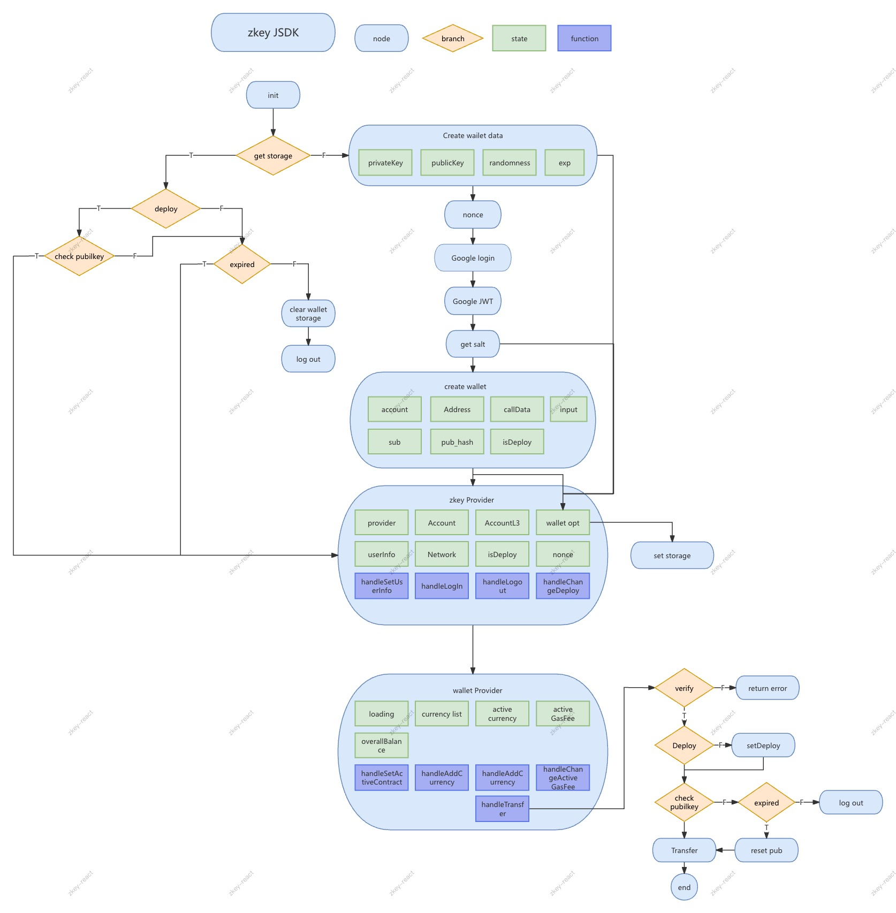

# zKey-react

The zKey-react component is based on the React framework and enables users to quickly create and log in to a Web3 wallet using third-party accounts such as Google or Facebook.

## Features

- Offers comprehensive Web3 wallet functionality
- Easy to use without requiring Web3 knowledge
- Simple and compatible with React and Next frameworks
- Highly extensible, with prototype instances available for further development

## Flowchart

<p align="center">
  
</p>

## Install

```bash
yarn add zkey-react
```

Or

```bash
npm install zkey-react
```

## How to Run

### The SDK provides a global provider to manage the application's login state and wallet instance. Make sure to include it at the outermost level of the app.

```jsx
import { ZKeyLoginProvider, WalletProvider } from "zkey-react";

export default App({ children }){
  return (
    <ZKeyLoginProvider>
      <WalletProvider>
        {children}
      </WalletProvider>
    </ZKeyLoginProvider>
  )
}
```

### Log in

Import it into the desired page and pass the application's clientId.
 
```jsx
import { GoogleLoginButton } from "zkey-react"
export default function Login {
  return (
    <div className='container'>
     <GoogleLoginButton clientId='xxx-xxx' />
    </div>
  );
};

```

## API

### ZKeyLoginProvider

| Prop                 |          Type          | Description                          |
| :------------------- | :--------------------: | :----------------------------------- |
| handleLogInCallback  | `（userInfo） => void` | Callback function after user login (data reference: userInfo)|
| handleLogOutCallback |       `function`       | Callback function after user logout                  |

### useZkState (User information and wallet instance)

| Prop            | Type                                                                                                                                                       | Description                                                   |
| --------------- | ---------------------------------------------------------------------------------------------------------------------------------------------------------- | ------------------------------------------------------------- |
| provider        | `RpcProvider`                                                                                                                                              | Wallet RPC instance (for further development and interaction with internal components)                   |
| userInfo        | `email:string; family_name:string; given_name:string;name: string;picture: string;`                                                                        | User information                                                      |
| globalAccount   | `AccountInterface`                                                                                                                                         | User wallet instance (for further development and interaction with internal components)                   |
| globalL3Account | `AccountInterface`                                                                                                                                         | Wallet instance for L3 version transactions, which can use STRK for gas settlement |
| walletDetail    | `address: string;callData: string[];exp: string;input: any;isDeploy: boolean;privateKey: string;pub_hash: string;publicKey: string;salt: string;sub: any;` | Wallet-related configuration parameters(for further development and interaction with internal components)            |
| loginLoading    | `boolean`                                                                                                                                                  | Login status                                                        |
| loadingContent  | `string`                                                                                                                                                   | Login status message used to notify the user                               |

### useZkDispatcher (Methods to change state and log out)

| Prop               |           Type            | Description            |
| :----------------- | :-----------------------: | :--------------------- |
| handleChangeDeploy | `(state:boolean) => void` | Used to switch account deployment status |
| handleUserLogOut   |        `function`         | Log out                |

### useWalletState （Wallet-related data）

| Prop              |                               Type                               | Description                                        |
| :---------------- | :--------------------------------------------------------------: | :------------------------------------------------- |
| walletLoading     |                            `boolean`                             | Wallet status query                                      |
| currencyList      | `{prices:number;balance:number; sum:number;walletName:string}[]` | List of currencies (includes user balances, exchange rates, and USD equivalent value) |
| overallBalance    |                             `number`                             | User's total currency balance (in USD equivalent)                  |
| activeWallet      |                            `Contract`                            | The currently selected currency instance                           |
| gasLoading        |                            `boolean`                             | Loading state for gas query                                 |
| activeWalletGas   |                         `string  number`                         | Estimated gas for the current transaction                                |
| transferLoading   |                            `boolean`                             | Loading state for the transfer process                                      |
| transferStateText |                             `string`                             | Transaction status message                                  |

### useWalletDispatcher （Wallet Operations）

| Prop                        |                        Type                         | Description                           |
| :-------------------------- | :-------------------------------------------------: | :------------------------------------ |
| handleChangeActiveContract  |             `(address:string) => void`              | Change the address of the currency to operate on            |
| handleAddCurrency           |          `(address:string) => promise<T>`           | Add the currency address to query             |
| handleWalletBalance         |                 `() => Promise<T>`                  | Manually trigger a refresh of the currency balance and other information        |
| handleChangActiveGasAddress |          `(address:string) => promise<T>`           | Change the gas payment currency address (supports only ETH or STRK) |
| handleGetGasFree            | `(amount: number, toAddress: string) => promise<T>` | Trigger a query for gas fees                     |
| handleTransfer              | `(amount: number, toAddress: string) => promise<T>` | Initiate a transaction                             |

## Maintainer

[@peiliang wang](https://github.com/dk264874293)。

### License

[MIT](LICENSE)
